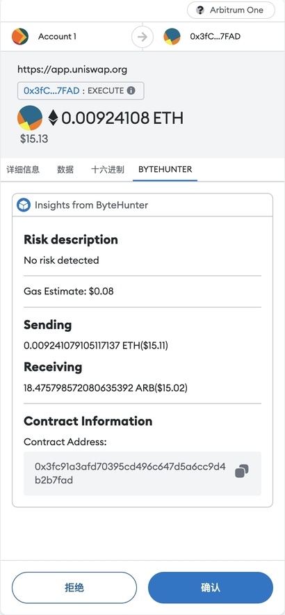

# ByteHunter Snap

ByteHunter Snap can help parse transactions and analyze their risks. You can intuitively see the assets transferred by the transaction, risk list and other information.

Example:

## Installation

Snap has been published on [NPM](https://www.npmjs.com/package/bytehunter-snap)

#### Local Usage

1. Install MetaMask Flask https://chrome.google.com/webstore/detail/metamask-flask-developmen/ljfoeinjpaedjfecbmggjgodbgkmjkjk
2. Setup wallet
3. Install Snap - Run `yarn start` in the root directory
4. Follow install process at `http://localhost:8080`
5. You can go test on any website that can be transaction.

## Contact Us

If you encounter any problems or errors in snap transaction data, Please contact us, thank you!

Discord: https://discord.com/invite/Ds8Jxm95G9
Email: bytehunter@futurevista.work
Tech Support: m2364410342@gmail.com
